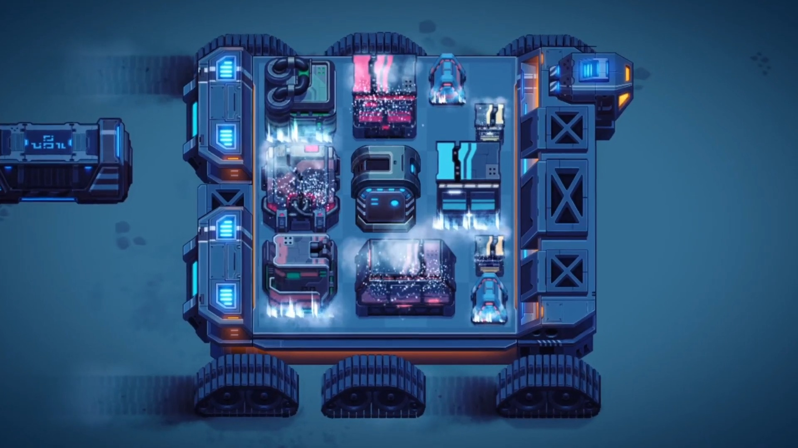

+++
author = "Smbat Voskanyan"
title = "Sandship: Crafting Factory"
date = "2021-02-15"
description = "The first project I worked on at Rockbite Games."
categories = [
    "Game Dev",
]
tags = [
    "Mobile Games",
    "Java",
    "LibGDX"
]
image = "http://rockbitegames.com/wp-content/uploads/2021/07/SandshipSide-art-min.png"
+++

Explore the world of [Sandship](https://play.google.com/store/apps/details?id=com.rockbite.sandship) blends the vastness of a Dune-like world with the addictive mechanics of Factorio.  It was one of my first projects at Rockbite Games and offered an array of exciting technical challenges. I played a crucial role in crafting the game's UI, implementing new elements, extensively refactoring for efficiency, and squashing bugs. Java and LibGDX were my tools of choice.



My work wasn't limited to just the UI.  As part of a small team, I contributed in many areas from backend development to gameplay programming. One standout feature for me was the "News" system.  To keep players connected, I built a Node.js microservice allowing our Community Management team to post website updates that seamlessly appeared in-game.

Ultimately, I made sure "Sandship" delivered a visually engaging and smooth player experience.  Tackling these challenges was as rewarding as seeing players immersed in the world we built.




