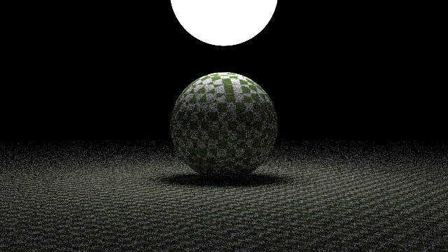
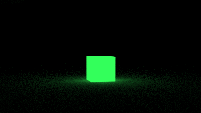
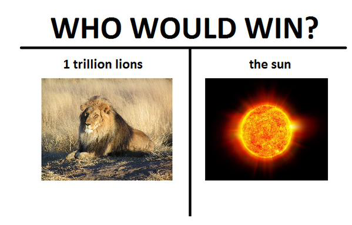

+++
author = "Smbat Voskanyan"
title = "Tiny Ray Tracer"
date = "2024-02-20"
description = "Building a Ray Tracer: My Journey from Basics to BVH Optimization."
categories = [
    "Computer Graphics"
]
tags = [
    "C++",
    "C",
    "Ray Tracing"
]
image = "https://senpie-portfolio.s3.eu-north-1.amazonaws.com/image+-+robo+fight+high+res.png"
+++

I have a background in programming, including a keen interest in graphics and game engine development. Inspired by the "Raytracing in One Weekend" book series and Jacco Bikker's insightful blog on ray tracing optimizations, I set out to build my own ray tracer.  My goal was to create a feature-rich ray tracer with a focus on performance. The source code is avaible on my **[github page](https://github.com/TheSenPie/tiny-ray-tracer)**. The rendered results are in the **[/renders](https://github.com/TheSenPie/tiny-ray-tracer/tree/main/renders)** folder.

# Foundational Features

## Scene Creation and Camera
To start, I implemented camera controls with "look-at" functionality. This allowed me to position the camera flexibly within a scene and adjust the image framing. I worked on defining basic materials: diffuse for matte surfaces, metal with adjustable fuzziness, and transparent glass. This enabled me to create scenes with a variety of visual effects.

## Image Refinement
Anti-aliasing was crucial for reducing jagged edges and creating smoother renders. I also tackled issues like shadow acne, where incorrect shadow calculations lead to visual artifacts.

Below is a evolution process from very basics to a fancy scene.

And the final hours, which took **~4 hours**. Enjoy!

# The Power of Optimization

## Early Multi-Threading Success
I began my performance work with multi-threading. Since ray tracing is inherently parallelizable (rays are independent calculations), this yielded immediate speedups.

## With great models comes great amount of primitives
To make my scenes more interesting it was time to add support for triangles and models. For ray triangle intersection I implemented class [Möller–Trumbore](https://en.wikipedia.org/wiki/M%C3%B6ller%E2%80%93Trumbore_intersection_algorithm) intersection algorithm, which is still pretty close to 'as fast as possible'. Next, I hooked up [Assimp](https://en.wikipedia.org/wiki/Open_Asset_Import_Library) for loading .obj [wavefront](https://en.wikipedia.org/wiki/Wavefront_.obj_file) files with their diffuse materials.

  

## The Heart of Acceleration: Bounding Volume Hierarchies

Since I had the models it was time to optimize, so I focused on implementing BVHs [Bounding volume hierarchy](https://en.wikipedia.org/wiki/Bounding_volume_hierarchy). The [article series](https://jacco.ompf2.com/2022/04/13/how-to-build-a-bvh-part-1-basics/) by Jacco Bikker were a great help for implementing fast BVHs. The performance gains here were even more drastic.

>4882 Spheres Scene 
>&emsp;*No BVH: 52936ms 
>&emsp;*Simple BVH: 896.871ms 
>&emsp;*Simple Jacco BVH: 1391.54ms 
>&emsp;*SAH Jacco BVH: 1321.69ms 
>&emsp;*SAH Jacco Iterative BVH: 725.51ms 
>
>11102 Triangles Dragon Model 
>&emsp;*No BVH: 250936ms 
>&emsp;*Simple BVH: 3904.27ms 
>&emsp;*Simple Jacco BVH: 1522.3ms 
>&emsp;*SAH Jacco BVH: 1298.32ms 
>&emsp;*SAH Jacco Iterative BVH: 974.8ms 

From numbers you can see around **70 times** faster render time for spheres scene and mind-blowing **250 times** faster rendering on dragon scene.

# Lessons Learned

## Performance is King
The BVH optimizations were a turning point, demonstrating the significant impact of efficient algorithms and data structures on rendering speed. There are other dirty optimizations, that I have on my to-do list, but I left them for later to keep the code readability simple for now.

## Debugging Tales

### Funny Visual Glitches
I encountered some annoying/amusing visual errors where models would render with parts inverted or cut off. Both issues stemmed from returning from intersection searches too early. Thorough testing with simplified models and debugging sessions resolved these.

  

### The Missing Volume
A numerical bug caused triangle bounding boxes to become flat, preventing ray intersections. After much head-scratching, I solved it with minor padding, similar to a solution mentioned in Peter Shirley's book.

# Updates: Scaling Up and Optimizing Further

After implementing BVHs based on Jacco's series, I successfully rendered a single robot. But who doesn't love a robot army?  Scaling up to 256 robots demanded an extra layer of optimization to manage this scene complexity.

Here's what I added:

**TLAS (Top-Level Acceleration Structure):** TLASes act like a 'manager' over multiple BVHs. They use agglomerative clustering, a bottom-up approach that makes building the hierarchy faster.  This is important when dealing with lots of individual models.

**BVH Instances:** These provide a flexible way to wrap my existing BVHs in a way that allows me to easily transform (translate, rotate, scale) the models. This let me position my robot army without having to rebuild the BVH for each robot.

As a result we have a significant speedup, allowing me to efficiently render a scene containing hundreds of complex models.

>I present you 256 robots in rotation.

# Putting it all Together: Lights, Camera, Render!

Since I had all the pieces of the puzzle, it was only natural to put them together.  With the ability to render spheres, complex models, and multiples of them efficiently, it was time to build a compelling scene.  However, a truly eye-catching scene requires well-placed lighting.  Let's dive into how I implemented emissive materials.

## Emissive Materials: Letting Robots Shine

To give my robots a striking appearance. I introduced an emissive material type. It works by biasing how light rays scatter, making certain surfaces appear to emit light. The implementation was straightforward, but the results transformed the look of the scene.

 

This addition laid the foundation for creative lighting design. With everything in place, I'm eager to share the final scene in my next update!

## Final Renders: When Visions Shift and Robots Party 

## The Epic (and Unexpectedly Funny) First Attempt

My first idea was to make this scene I had in mind for a couple of weeks. Sun surrounded with EVA-01 robots from the Evangelion series. There were many tiny spheres which surrounded the scene and looked like particles from the sun. In my mind, I though it was the most epic shit, however the results turned out rather funny. 

One of my friends sent me this meme when he saw the render, which made it even funnier.

## Pivoting to Awesome: The Robot Party is Born

No time to play! I still wanted to make a cool-looking render, so I reimagined the whole scene to look like a cool robot party with a bunch of emissive spheres and a light beacon in the middle. I think the results turned out super cool!

## Lessons Learned

This whole experience taught me a couple of things:

* **The Unexpected is Part of the Fun:** Sometimes, the best things come out of left field. A little humor and a not-so-perfect first render can make the process even more enjoyable.

* **Don't be Afraid to Iterate:** If something isn't working, toss it and start again!  There's no shame in changing direction to find something truly awesome.

* **Visuals Matter (and Robots are Cool):** A great final render is its own reward. Plus, ray tracing can make robots look absolutely epic (even when they're partying).

**I hope you enjoyed this peek into my ray tracer project – from epic fails to robot raves!** 

# Thanks
First, I wanted to thank **Peter @Peter_shirley Shirley** and **Jacco @j_bikker Bikker** for putting such high-quality content out there for free, for people like me to be inspired and thrive to improve our skills in computer graphics.  

Secondly, I want to thank my friends and brilliant game developers **Andranik @andranik3949 Melikyan** and **Bagrat @dBagrat Dabaghyan** for helping me out when I got stuck with stupid bugs and getting me out of burnout state!

# Next Steps:
**Lighting Expansion:** Update: Completed! Implementing emissive lights will allow for more realistic and nuanced lighting effects. 
**Better Model Support:** Add support for Normal Mapping, Metalness and Roughness maps. Although, for later other stuff should be refactored too.
**Advanced Sampling:** I'll explore monte carlo algorithms for smoother images and reduced visual artifacts and other probabilistic models for predicting properties of light scattering in scene. 
**GPU Acceleration:** Re-implementing my path tracer in CUDA will allow for faster render times and the ability to tackle even more complex scenes. 




