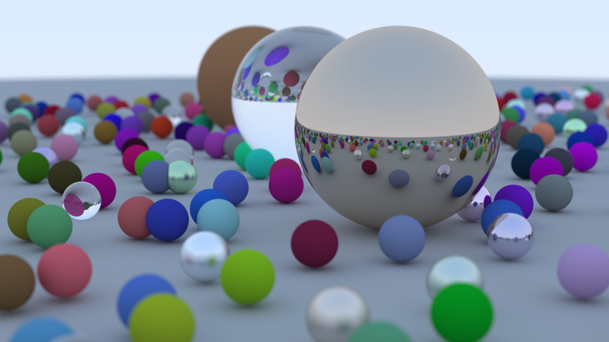
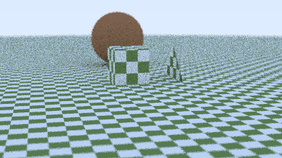
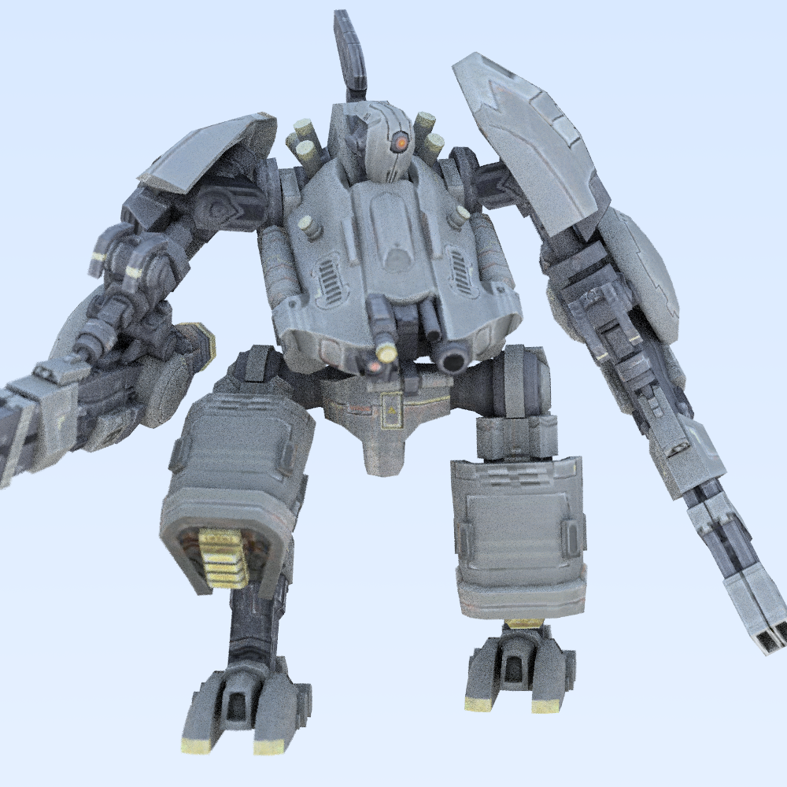
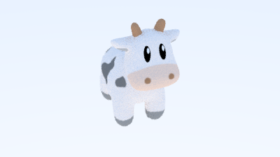
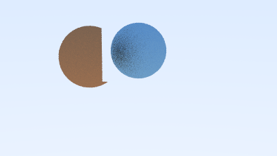
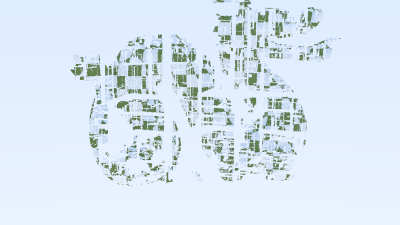
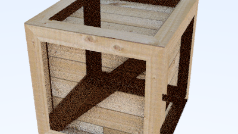

+++
author = "Smbat Voskanyan"
title = "Tiny Ray Tracer"
date = "2024-02-20"
description = "Building a Ray Tracer: My Journey from Basics to BVH Optimization."
categories = [
    "Computer Graphics"
]
tags = [
    "C++",
    "C",
    "Ray Tracing"
]
image = "final_render.png"
+++

I have a background in programming, including a keen interest in graphics and game engine development. Inspired by the "Raytracing in One Weekend" book series and Jacco Bikker's insightful blog on ray tracing optimizations, I set out to build my own ray tracer.  My goal was to create a feature-rich ray tracer with a focus on performance. The source code is avaible on my **[github page](https://github.com/TheSenPie/tiny-ray-tracer)**. The rendered results are in the **[/renders](https://github.com/TheSenPie/tiny-ray-tracer/tree/main/renders)** folder.

# Foundational Features

## Scene Creation and Camera
To start, I implemented camera controls with "look-at" functionality. This allowed me to position the camera flexibly within a scene and adjust the image framing. I worked on defining basic materials: diffuse for matte surfaces, metal with adjustable fuzziness, and transparent glass. This enabled me to create scenes with a variety of visual effects.

## Image Refinement
Anti-aliasing was crucial for reducing jagged edges and creating smoother renders. I also tackled issues like shadow acne, where incorrect shadow calculations lead to visual artifacts.

Below is a evolution process from very basics to a fancy scene.

And the final hours, which took **~4 hours**. Enjoy!

# The Power of Optimization

## Early Multi-Threading Success
I began my performance work with multi-threading. Since ray tracing is inherently parallelizable (rays are independent calculations), this yielded immediate speedups.

## With great models comes great amount of primitives
To make my scenes more interesting it was time to add support for triangles and models. For ray triangle intersection I implemented class [Möller–Trumbore](https://en.wikipedia.org/wiki/M%C3%B6ller%E2%80%93Trumbore_intersection_algorithm) intersection algorithm, which is still pretty close to 'as fast as possible'. Next, I hooked up [Assimp](https://en.wikipedia.org/wiki/Open_Asset_Import_Library) for loading .obj [wavefront](https://en.wikipedia.org/wiki/Wavefront_.obj_file) files with their diffuse materials.

  

## The Heart of Acceleration: Bounding Volume Hierarchies

Since I had the models it was time to optimize, so I focused on implementing BVHs [Bounding volume hierarchy](https://en.wikipedia.org/wiki/Bounding_volume_hierarchy). The [article series](https://jacco.ompf2.com/2022/04/13/how-to-build-a-bvh-part-1-basics/) by Jacco Bikker were a great help for implementing fast BVHs. The performance gains here were even more drastic.

>4882 Spheres Scene 
>&emsp;*No BVH: 52936ms 
>&emsp;*Simple BVH: 896.871ms 
>&emsp;*Simple Jacco BVH: 1391.54ms 
>&emsp;*SAH Jacco BVH: 1321.69ms 
>&emsp;*SAH Jacco Iterative BVH: 725.51ms 
>
>11102 Triangles Dragon Model 
>&emsp;*No BVH: 250936ms 
>&emsp;*Simple BVH: 3904.27ms 
>&emsp;*Simple Jacco BVH: 1522.3ms 
>&emsp;*SAH Jacco BVH: 1298.32ms 
>&emsp;*SAH Jacco Iterative BVH: 974.8ms 

From numbers you can see around **70 times** faster render time for spheres scene and mind-blowing **250 times** faster rendering on dragon scene.

# Lessons Learned

## Performance is King
The BVH optimizations were a turning point, demonstrating the significant impact of efficient algorithms and data structures on rendering speed. There are other dirty optimizations, that I have on my to-do list, but I left them for later to keep the code readability simple for now.

## Debugging Tales

### Funny Visual Glitches
I encountered some annoying/amusing visual errors where models would render with parts inverted or cut off. Both issues stemmed from returning from intersection searches too early. Thorough testing with simplified models and debugging sessions resolved these.

  

### The Missing Volume
A numerical bug caused triangle bounding boxes to become flat, preventing ray intersections. After much head-scratching, I solved it with minor padding, similar to a solution mentioned in Peter Shirley's book.

# Next Steps:
**Lighting Expansion:** Implementing emissive lights will allow for more realistic and nuanced lighting effects. 
**Advanced Sampling:** I'll explore integrating blue noise sampling for smoother images and reduced visual artifacts and other probabilistic models for predicting properties of light scattering in scene. 
**GPU Acceleration:** Re-implementing my path tracer in CUDA will allow for faster render times and the ability to tackle even more complex scenes. 




